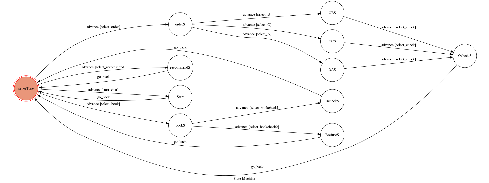

# TOC Project 2017

Code for TOC Project 2017

A telegram bot based on a finite state machine

## Setup

### Prerequisite
* Python 3

#### Install Dependency
```sh
pip install -r requirements.txt
```

* pygraphviz (For visualizing Finite State Machine)
    * [Setup pygraphviz on Ubuntu](http://www.jianshu.com/p/a3da7ecc5303)

### Secret Data

`API_TOKEN` and `WEBHOOK_URL` in app.py **MUST** be set to proper values.
Otherwise, you might not be able to run your code.

### Run Locally
You can either setup https server or using `ngrok` as a proxy.

**`ngrok` would be used in the following instruction**

```sh
ngrok http 5000
```

After that, `ngrok` would generate a https URL.

You should set `WEBHOOK_URL` (in app.py) to `your-https-URL/hook`.

#### Run the sever

```sh
python3 app.py
```

## Finite State Machine


## Usage
The initial state is set to `severType`.

一開始直接進入`Start` state,印出開始服務文字，再回到`severType`

之後可以用 order, book, recommend 三個指令，分別進入 `orderS` state, `bookS` state, `recommendS` state

進入`orderS`後會問想要訂的餐點，選A,B,C分別進入三個state，可以詢問想要的份數，

同時秀出圖片，最後結算總價，回到`serverType` state

進入`bookS`後會詢問想要的人數，若小於等於4人，會進入`BcheckS` state，印出確認文字，回到`serverType` state，若大於4人，則取消訂位，回到`serverType` state

進入`recommendS`後會根據今天的日期推薦不同的餐點，並回到`serverType` state


## Author
[F74036302](https://github.com/F74036302)